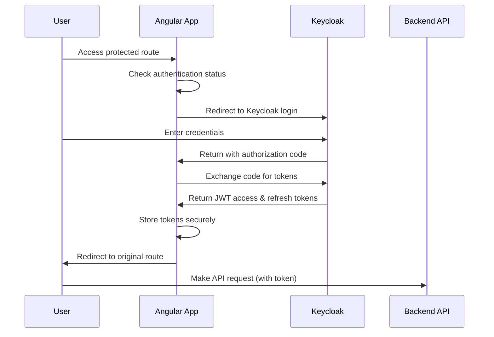
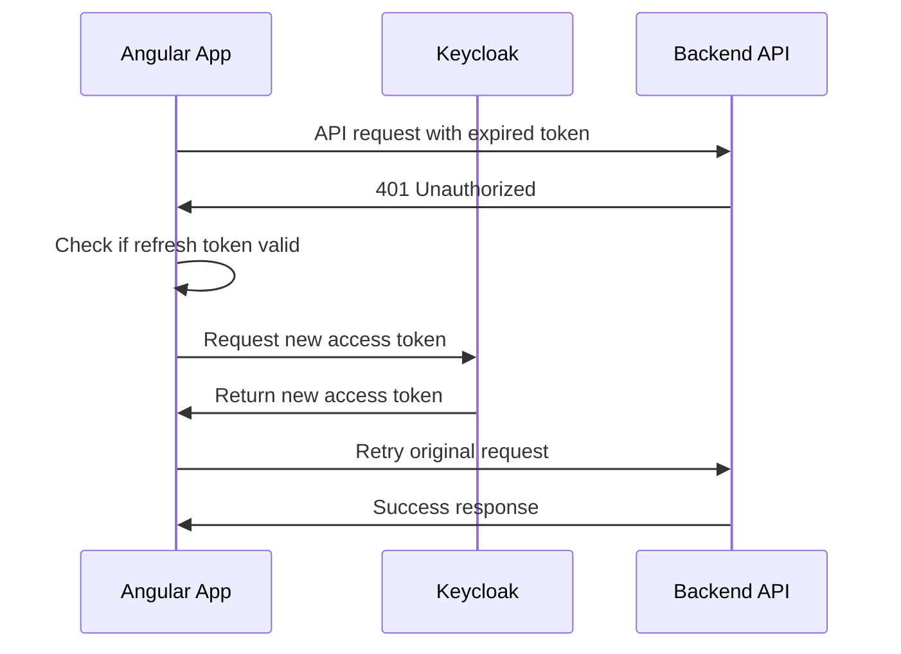

# Design: Keycloak Authentication Integration

## Architecture Overview

This design implements OAuth2/OpenID Connect authentication using Keycloak as the Identity Provider for the OELAPA Property Management System. The solution follows Angular best practices and integrates seamlessly with the existing Angular 20 application structure within an Nx monorepo. The OELAPA application was created using `nx g @nx/angular:app apps/oelapa` and all development commands should use the Nx CLI.

## High-Level Architecture

```
┌─────────────────┐    ┌─────────────────┐    ┌─────────────────┐
│   Nx Workspace  │    │   Keycloak      │    │   Backend APIs  │
│   (oelapa app)  │◄──►│   Server        │◄──►│   (Future)      │
└─────────────────┘    └─────────────────┘    └─────────────────┘
        │                       │                       │
        │                       │                       │
    ┌───▼────┐              ┌───▼────┐              ┌───▼────┐
    │ JWT    │              │ User   │              │ API    │
    │ Tokens │              │ Store  │              │ Guard  │
    └────────┘              └────────┘              └────────┘
```

## Nx Monorepo Integration

### Project Structure
```
workspace/
├── apps/
│   └── oelapa/                    # Angular application
│       ├── src/
│       │   ├── app/
│       │   │   ├── auth/          # Authentication module
│       │   │   ├── login/         # Login component
│       │   │   └── guards/        # Route guards
│       │   └── environments/      # Environment configs
│       └── project.json           # Nx project configuration
├── libs/                          # Shared libraries (future)
│   └── shared-auth/               # Potential shared auth library
└── nx.json                        # Nx workspace configuration
```

## Component Architecture

### 1. Authentication Service Layer
```typescript
// Core service managing all Keycloak interactions
AuthenticationService
├── KeycloakService (wrapper)
├── TokenManager
├── UserProfileManager
└── SessionManager
```

**Responsibilities:**
- Initialize Keycloak on app startup
- Handle OAuth2/OIDC authentication flow
- Manage JWT token lifecycle (storage, refresh, validation)
- Provide authentication state to components
- Handle logout and session cleanup

### 2. UI Component Layer
```typescript
// Login page and authentication-related UI
LoginComponent
├── LoginForm (Angular Material)
├── LoadingIndicator
├── ErrorDisplay
└── RedirectHandler
```

**Responsibilities:**
- Present user-friendly login interface
- Handle form validation and user input
- Display authentication status and errors
- Manage navigation after successful login

### 3. Security Layer
```typescript
// Route protection and request security
SecurityLayer
├── AuthGuard (CanActivate)
├── AuthInterceptor (HTTP)
├── TokenRefreshHandler
└── ErrorHandler
```

**Responsibilities:**
- Protect routes requiring authentication
- Automatically attach tokens to API requests
- Handle token expiration and refresh
- Manage authentication errors and redirects

## Authentication Flow

### Login Flow


### Token Refresh Flow


## Security Considerations

### Token Storage
- **Access Tokens**: Stored in memory (not localStorage/sessionStorage)
- **Refresh Tokens**: Secure HTTP-only cookies (when possible) or secure storage
- **Session State**: Angular service with automatic cleanup

### CORS Configuration
```json
{
  "keycloak": {
    "cors": {
      "allowedOrigins": ["http://localhost:4200", "https://oelapa.example.com"],
      "allowedMethods": ["GET", "POST", "OPTIONS"],
      "allowCredentials": true
    }
  }
}
```

### Error Handling Strategy
1. **Network Errors**: Retry with exponential backoff
2. **Authentication Errors**: Clear state and redirect to login
3. **Authorization Errors**: Show appropriate error messages
4. **Token Expiration**: Automatic refresh or re-authentication

## Configuration Management

### Environment Configuration
```typescript
// apps/oelapa/src/environments/environment.ts
export const environment = {
  production: false,
  keycloak: {
    url: 'http://localhost:8080',
    realm: 'oelapa',
    clientId: 'oelapa-frontend',
    redirectUri: 'http://localhost:4200/auth/callback'
  }
};
```

### Nx Development Commands
```bash
# Serve the application
nx serve oelapa

# Build the application
nx build oelapa

# Run tests
nx test oelapa

# Run e2e tests
nx e2e oelapa

# Generate components
nx g component login --project=oelapa
nx g service auth --project=oelapa
nx g guard auth --project=oelapa
```

### Keycloak Client Configuration
```json
{
  "clientId": "oelapa-frontend",
  "clientProtocol": "openid-connect",
  "publicClient": true,
  "redirectUris": ["http://localhost:4200/*"],
  "webOrigins": ["http://localhost:4200"],
  "standardFlowEnabled": true,
  "implicitFlowEnabled": false
}
```

## Component Interfaces

### Authentication Service Interface
```typescript
interface IAuthenticationService {
  isAuthenticated(): boolean;
  login(): Promise<void>;
  logout(): Promise<void>;
  getToken(): string | null;
  getUserProfile(): UserProfile | null;
  refreshToken(): Promise<string>;
}

interface UserProfile {
  id: string;
  username: string;
  email: string;
  firstName: string;
  lastName: string;
  roles: string[];
}
```

### Route Guard Interface
```typescript
interface IAuthGuard extends CanActivate {
  canActivate(route: ActivatedRouteSnapshot, state: RouterStateSnapshot): boolean;
  handleUnauthorized(redirectUrl: string): void;
}
```

## Integration Points

### Application Bootstrap
```typescript
// apps/oelapa/src/app/app.config.ts integration
export const appConfig: ApplicationConfig = {
  providers: [
    // ... existing providers
    provideKeycloak(),
    provideAuthenticationServices(),
    provideHttpInterceptors(),
  ],
};
```

### Route Configuration
```typescript
// apps/oelapa/src/app/app.routes.ts integration
export const appRoutes: Route[] = [
  { path: 'login', component: LoginComponent },
  { path: 'dashboard', component: DashboardComponent, canActivate: [AuthGuard] },
  { path: '', redirectTo: '/dashboard', pathMatch: 'full' },
  { path: '**', redirectTo: '/login' }
];
```

## Testing Strategy

### Unit Testing
- Mock Keycloak service for isolated component testing using Nx testing utilities
- Test authentication state changes with Jest
- Verify token handling logic
- Test error scenarios and edge cases using Nx test runners

### Integration Testing
- End-to-end authentication flow testing using `nx e2e oelapa`
- Token refresh mechanism validation
- Route protection verification
- Cross-browser compatibility testing in Nx environment

### Security Testing
- Token storage security validation
- CSRF protection verification
- XSS prevention testing
- Session management security testing with Nx dev tools

## Performance Considerations

### Optimization Strategies
1. **Lazy Loading**: Load authentication module only when needed
2. **Token Caching**: Cache valid tokens to minimize Keycloak requests
3. **Background Refresh**: Refresh tokens before expiration
4. **Connection Pooling**: Reuse HTTP connections to Keycloak

### Monitoring Points
- Authentication success/failure rates
- Token refresh frequency
- Login page load times
- API request latency with token overhead

## Migration and Rollback

### Migration Strategy
1. Deploy Keycloak server in parallel
2. Feature flag authentication requirement
3. Gradual rollout to user segments
4. Monitor authentication metrics

### Rollback Plan
1. Disable authentication feature flag
2. Revert to anonymous access temporarily
3. Fix authentication issues
4. Re-enable with fixes